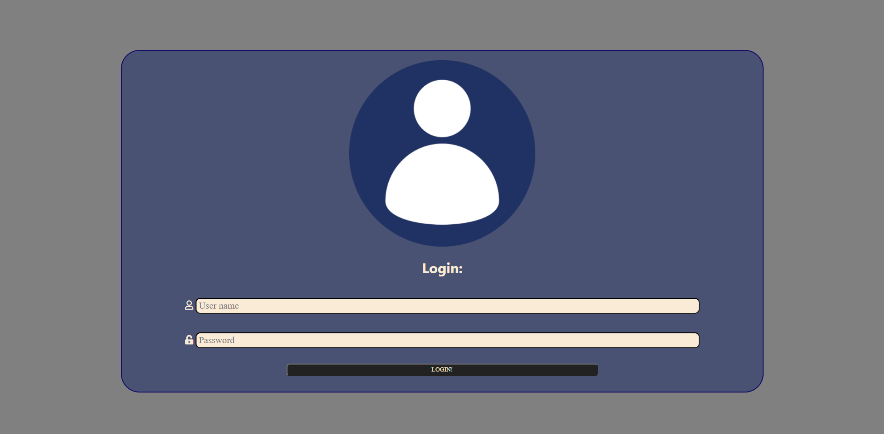
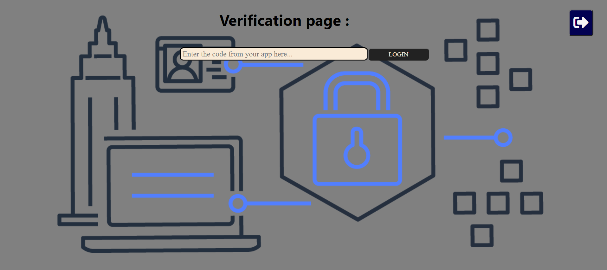
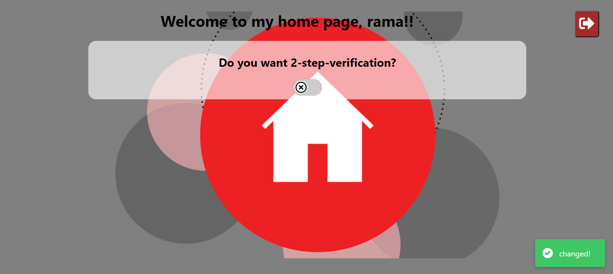
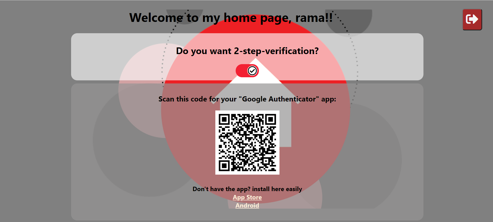

# 2-step-verification

### Solution to a task in the Cyber4s course.

### Developed using REACT, CSS, HTML , Node JS, Express, Cors, Nodemon

---

### My app -

### General Information ℹ

#### Local installation :

- **Clone this repo**
- **run `npm i`**
- **run `npm run dev` - to run the server**
- **run `npm start` - to run the front**

#### Functionality : 🧬🛠⚙

- **Login Page -** Login by username and password (without registration). If the username is already in use or the password is incorrect you will receive a pop-up message.
- **Verification page -** A page that will only be reached by those who have selected "2-step-verification" on the home page. An intermediate step between logging in to the home page where you have to enter the code from the app in order to continue.
- **Home page -** A page where you can choose whether you want the extra security or not. If so you will see a QR code to scan and if not the option in DB will be disabled but your QR code will remain fixed.

#### Development : 👩‍💻👨‍💻

- **User information is stored as objects in an array on the server**
- **Using the [node-2fa](https://www.npmjs.com/package/node-2fa) package to create "2-step-verification" security**
- **Password hashing and salting with [bcrypt](https://www.npmjs.com/package/bcrypt) package**

#### Future : 👩‍🚀👨‍🚀

- **Conversion to private react router**
- **Making the DB persistent**
- **Convert to TypeScript**
- **Registration page**

---

### Pics 📸

##### **LOGIN PAGE**

##### **VERIFICATION PAGE**

##### **HOME PAGE**

---

### Task instructions -

Implement a small application with 2-step verification.

- [x] Download Google Authenticator (or another app you prefer) on your phone
  - You can try to first enable 2-step verification for LinkedIn to figure out how it works
- **Write a small client-side with:**
  - [x] a login page with a username + password form
  - [x] a home page with a warm welcome, and a button for setting-up 2-step verification
  - [x] a 2-step verification page with a form for the code from the authenticator app
- **Write a small server that stores user details**
  - [x] Passwords must be saved securely! Use hashes with salts (you can find an npm package for that)
  - [x] When a user logs in, they are redirected to the home page
  - [x] If the user has 2-step verification enabled, they are redirected to the 2-step verification page (and then to the home page)
- **When a user wishes to enable 2-step verification:**
  - [x] the server generates a secret key, which is stored with the user's details
  - [x] the user is presented with a QR code, which they can scan with the authenticator app
  - [x] use this package: https://www.npmjs.com/package/node-2fa
- Don't waste your time on other things such as styling, DBs, etc. Make it as simple as possible.
- If you wish you can piggyback on one of your existing projects.
